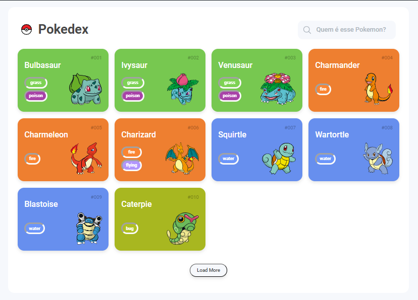

<h1 align="center"> Pokedex </h1>

 Uma pokedex para ver seus pokemons favoritos! 

 
    <a href="#-sobre-o-projeto">Projeto</a>&nbsp;&nbsp;&nbsp;│&nbsp;&nbsp;&nbsp;
    <a href="#-tecnologias">Tecnologias</a>&nbsp;&nbsp;&nbsp;│&nbsp;&nbsp;&nbsp;
    <a href="#-features">Features</a>&nbsp;&nbsp;&nbsp;│&nbsp;&nbsp;&nbsp;
    <a href="#-licença">Licença</a>&nbsp;&nbsp;&nbsp;│&nbsp;&nbsp;&nbsp;
    <a href="#-dicas-para-usar-o-projeto">Dicas de uso</a>

 
    

 

 
    

### 💻 Sobre o projeto

O projeto é um site para mostrar todos os pokemons.

Tem como objetivo a utilização como pokedex e conseguir visualizar e pesquisar os pokemons existentes. Contem os status detalhados para cada criatura quando clica no card ou pesquisa na busca. Total de 649 pokemons.

Clique no link abaixo para explorar o projeto completo e descobrir todas as suas funcionalidades:

### 🚀 Tecnologias

Esse projeto foi desenvolvido com as seguintes tecnologias:

- HTML
- CSS
- Javascript
- Git e Github
- Netlify

### 🚧 Features

- [x] Tela inicial mostrando a lista de pokemon pela api
- [x] Tela de detalhes de cada pokemon
- [x] Utilizar a api
- [x] Ter um campo para pesquisar os pokemons
- [x] Fazer a pesquisa em tempo real com uma lista de sugestões dos nomes de pokemons
- [x] Colocar as evoluções dos pokemons na tela de detalhes
- [ ] Colocar as fraquezas dos pokemons na tela de detalhes

### 📜 Licença

Esse projeto está sob a licença MIT.

### 💡 Dicas para usar o projeto

Para conseguir visualizar a pagina é necessário utilizar a extensão "live server" pelo vscode.

---

Projeto feito através de um bootcamp. Alterado e adicionado algumas funcionalidades por KetCode.
